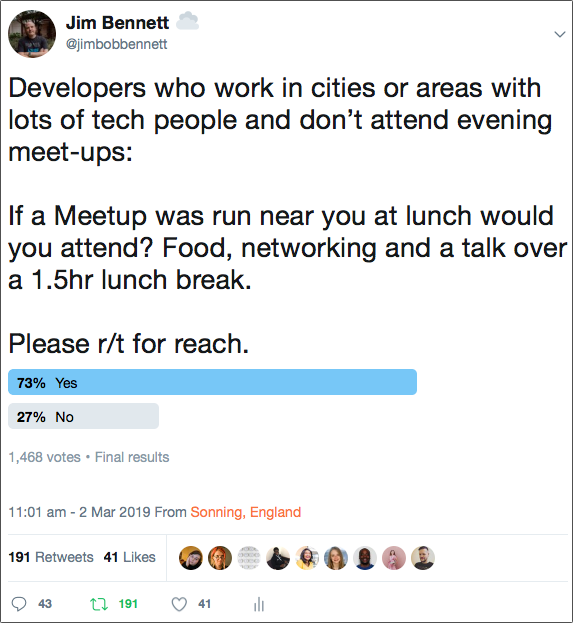

# Making technology Meetups more accessible

## A typical technology Meetup

Meetups are a great way to build a technology community. They typically consist of an evening event at a space provided by a sponsor, some food (normally pizza), drinks (soda and beer) and networking, followed by one or more talks around a particular subject. Most meetups are organized via [Meetup.com](https://meetup.com).

These events provide a lot of upsides:

* They are a fun way to spend an evening
* You usually get free food and drink
* You have a chance to meet and network with other like-minded people, which can lead to friendships or jobs
* You have a chance to learn from some great speakers, discover new technologies and get inspired to try new things
* They support building communities in a particular area
* You can engage with the speaker, asking questions and chat further afterwards

These events also have a lot of downsides:

* They are usually run in the evening in a fixed venue - meaning not accessible to attendees or potential speakers who cannot or do not want to go out in the evening. For example:
  * Parents or carers who need to look after others in the evening, especially single parents or individual carers
  * People with disabilities that limit their ability to travel
  * People who have limited travel capabilities (for example no car, not near public transport, rely on working from home or car sharing)
  * People with other evening commitments such as work, sports clubs, lifelong learning
  * Depending on the location, these events might not be easily or safely accessible. There may be limited transport options in the evening, or attendees may not feel safe walking back to transport in the dark from the venue (this was given as a reason for people not wanting to attend one particular meetup)
  * People who just don't want to go out after a day at work, or are stuck in the office (classic reason in the tech space - a production issue)
* Traditionally the catering for a meetup is 'pizza and beer', which is not inclusive for those who don't want or cannot eat pizza and beer, especially if the offering doesn't include vegetarian, vegan, gluten free, keto
* The event is usually the only time to chat to the speaker, and face to face is encouraged. This doesn't support those who don't want to put up their hand or approach a speaker
* These events don't have subtitles for hearing impaired, or audio description for visually impaired
* If you are a parent these events don't have support for child care, mothers rooms
* These events often need a speaker in person. Some will support a remote speaker but it is not the norm

## Making these events better

There are a number of ways that these events can be made more inclusive. There is no one magic bullet - some changes will work for some communities but not for others. Some improvements are blocked by lack of sponsorship. This is a list of suggestions to improve.

### Changing the time

Evening meetups are great for some people, others would prefer to meet at lunch time, in the morning or in the evening. [@JimBobBennett](https://twitter.com/jimbobbennett) ran a twitter poll around this:

https://twitter.com/jimbobbennett/status/1101799801514008578

Lunchtime meetups have problems, but they do provide a different time slot that may be more accessible. Attendees might also be more open to a 'brown bag' session, so bring their own lunch instead of needing sponsorship for food, reducing the cost of an event.

The time consideration is important - for example if you are a single parent or a school-aged child and you work during the day. If you can attend a meetup during your lunch break then you don't have to have any impact on collecting your child from school/after-school care.

> Lunch breaks can be limited in terms of time, but many people don't feel it is unreasonable to ask for a longer lunch to learn a new skill. This is growth time, and as such a good employer should support you going.

To make a lunchtime meetup successful:

* It needs to be hosted near to attendees and speakers. Lunch breaks are limited in time, so you need to be near to attendees and speakers to reduce travel time. This works well in small-medium sized cities with a good technology community.
* It should be short and on time - no more than one hour
* Networking is limited, so maybe arrange another lunchtime event the next day or week for networking or a social discussion around the last speaker

Breakfast events can also be successful, with similar limitations to a lunchtime event.

### Being on-line as well

Some people simply cannot or do not want to travel to meetups, but want to be engaged with a community and watch talks. This can be achieved in the same way as remote working - using the tools available to build an on-line community.

#### A chat tool

Having a chat tool like Slack available allows for discussions and networking at any time, from anywhere accessible to those who cannot attend in person, or don't want to initiate in public questioning and conversation. A well run slack team should have different channels for areas of discussion and be **well moderated**. The code of conduct for the meetup applies on the chat channels and **MUST** be enforced there as well.

After a meetup, this can be a good place to chat about the event and engage with the speaker, who should be encouraged to join the chat and engage with the audience. Attendees can answer questions without needing to put up their hand or approach a stranger.

These chat tools can also keep the conversation going on outside the physical events. It allows job openings to be shared, content such as blog posts to be publicized, and discussions to be kicked off around technology or anything. They can also be used by the group organizers to solicit feedback - how can they improve the community, what topics are the community interested in?

#### Live streamed meetups

Not everyone can attend a meetup in person, so why not live-stream it using tools like Twitch. This way there can be virtual attendees, they can watch the speakers and engage in chat using the streaming tools. There needs to be a moderator, enforcing the code of conduct and forwarding questions to the speaker from the chat stream.

This opens up so many more people to the event, allowing them to attend from home. This live stream can bring together separate meetup groups in different locations. For example a live stream at the [London .NET user group](https://www.meetup.com/London-NET-User-Group/) could be posted on the [Milton Keynes .NET user group](https://www.meetup.com/Milton-Keynes-NET-Meetup-Group/) meetup page as a virtual event, maybe even have a physical meetup in Milton Keynes to watch the live stream together.

By live streaming meetups, the time problem becomes easier. If you want to get involved in a meetup at lunchtime then it could be an event in your timezone that is hosted at lunch, or an evening event in a different timezone. The content then becomes available to a larger audience, bringing together a bigger community of people.

Once live streaming is part of the community culture, having more remote events becomes possible, including live streaming remote speakers to a physical event.

> Twitch setup can be complicated, bringing in microphones, the presenters screen and a video feed of the presenter. Please raise a PR with some suggestions for an easy to use setup!

### Providing content to watch later

Sometimes it is just not possible to be available at the time a meetup is running. If you are still interested in the content then viewing it later is a great option. At the very least a recording of the event using a simple webcam and microphone. Ideally a recording of the live stream including the on-line chat and a mix of the presenters screen and a camera.

### Fixing up the food and facilities

If you are having a physical meetup then there are some things you can do to make it more inclusive. Some are easy, some less so as they are expensive - but try to do as much as possible.

#### Accessible and inclusive space

Make sure the space is accessible for differently-abled people, including ease of access for mobility impaired people. Most modern buildings have this sorted, but if you are using an older space like a village hall or pub back room then make sure it is accessible. If you are setting out chairs, make sure there is space for wheelchairs if needed, and space for people to move between rows.

Consider gender neutral toilets. Sometime this is as simple as changing the signs to say gender neutral on any toilets marked as gents and ladies, and indicate that one is stalls only and one has urinals.

#### Inclusive food

Yes, pizza is easy - but grab some gluten free, vegan, vegetarian and some salads for those of us who don't want or can't eat carbs. Label the food as well, and tell everyone what it is, ensuring those with dietary requirements get priority on the food. Having vegan pizza is only good if it doesn't get eaten by omnivores who didn't know it was vegan.

Speaking as a type-1 diabetic Pizza is really bad for my sugar levels. If you can, order different food to cater for all tastes and preferences - maybe get the local Indian to put together a buffet.

Same with drinks - have hot, cold, soft, alcohol. Don't just get 'lots of beer' - some people don't drink, soe do but can't have gluten so beer is out. Get a good selection. Your code of conduct should cover alcohol consumption as well. Anyone drunk and disorderly should be banned.

Above all though, engage with your community and ask what they want.

#### Parents facilities

Being a parent is hard and it limits what you can do and events you can attend. Rather than make meetups exclusive to parents, there are ways to make it inclusive.

Firstly for breastfeeding mums, there should be absolutely no issues with feeding happening during a meetup - either an attendee or the speaker feeding their child. This should be a part of the code of conduct. If a mum want's privacy, then there should be a space to do this. Same as if their child is upset or crying and the parent needs a quiet space to calm them down.

For older kids, child care should be provided. I say should, though I appreciate how expensive this is, and how most venues are not set up to care for children. Please raise a PR with any thoughts around how this could be done better. Some ideas include parents banding together over slack and having a parents meetup at one persons house, where kids can play together whilst the parents watch the live stream.

## A perfect meetup

There is no such thing, but to me a perfect meetup group has:

* A great online community chatting in a tool like Slack
* All events live-streamed with moderated chat during the event so questions from the virtual audience can be answered
* A virtual community beyond the physical meetup engaging with the live stream, mixing different meetup groups
* A recording available offline
* All events at a mixture of times to suit everybody
* Great food and drink that suits everyone's dietary requirements
* One or more locations that are inclusive of everyone, with support for parents

Please raise a PR with your thoughts and suggestions.

## Validating these suggestions

Anecdotally changes can help. The [Adelaide SQL User Group](https://twitter.com/adssug) runs at lunchtime to a full room, so does the [Auckland Azure Lunchtime Meetup](https://www.meetup.com/Auckland-Azure-Lunchtime-Meetup/).

Ideally we need data to verify suggestions. This is where **you** come in.

### Recording (edited video)

Try recording your meetup and post the data below in a [pull request](https://github.com/jimbobbennett/MakingMeetupsMoreAccessible/pulls).

| Meetup Group  | Video views (online time) | Link | RSVP | went | no-show | time between announcement and meetup day |
| ------------- | ----------- | ---- | ---- | -----| ------- | --------- |
| dotnet.Amsterdam (https://www.meetup.com/dotnet-amsterdam/events/264336052/) | 88 (1 week ago) | https://youtu.be/5Zrg9LfukLQ | 37 | 32 (4 with no rsvp) | 9 | 1 week |
| dotnet.Amsterdam (https://www.meetup.com/dotnet-amsterdam/events/261233668/) | 132 (2 months ago) | https://youtu.be/ndOLeNjFk_w | 41 | 25 | 16 | ~ 2-3 weeks |
| dotnet.Amsterdam (https://www.meetup.com/dotnet-amsterdam/events/261490238/) | 140 (3 months ago) | https://youtu.be/gahGr-cek-E | 25 | 10 | 15 | 2 weeks |
| dotnet.Amsterdam (https://www.meetup.com/dotnet-amsterdam/events/261490238/) | 182 (3 months ago) | https://youtu.be/26w_GaiuxQs | 25 | 10 | 15 | 2 weeks |
| dotnet.Amsterdam (https://www.meetup.com/dotnet-amsterdam/events/259218199/) | 59 (5 months ago) | 53 | 43 | 10 | ~ 2 weeks |
| dotnet.Amsterdam (https://www.meetup.com/dotnet-amsterdam/events/255737023/) | 93 (10 months ago) | https://youtu.be/-wycjfKA8c0 | 33? | 33 | ? | ~ 4 weeks? |
| dotnet.Amsterdam (https://www.meetup.com/dotnet-amsterdam/events/255737023/) | 5418 (10 months ago) | https://youtu.be/XLHeJgWovI4 | 33? | 33 | ? | ~ 4 weeks? |

### Live streaming

Try live streaming your meetup and post the data below in a [pull request](https://github.com/jimbobbennett/MakingMeetupsMoreAccessible/pulls).

| Meetup Group  | Live views | Recording views | Link |
| ------------- | ---------- | ----------- | ---- |
| dotnet.Amsterdam (https://www.meetup.com/dotnet-amsterdam/events/264336052/) | 7 | n.a. | offline |
| dotnet.Amsterdam (https://www.meetup.com/dotnet-amsterdam/events/261233668/) | 8 | 20   | https://youtu.be/FViPbgO4fMo |
| dotnet.Amsterdam (https://www.meetup.com/dotnet-amsterdam/events/259218199/) | 9 | 28 | https://youtu.be/evFV9aaWE7M
| dotnet.Amsterdam (https://www.meetup.com/dotnet-amsterdam/events/255737023/) | 7 | 104 | https://youtu.be/E3LSTJhNcKc

### Different times

Try changing the time of your event from evening to a lunchtime or weekend every other month. Post attendance data in the table below. When you do this, compare the attendees at each event and see if there are differences. If the groups are mainly different then maybe you could run multiple events each month, one in an evening, one during a lunchtime or weekend.

| Meetup Group                             | Evening attendance | Lunchtime attendance | Breakfast attendance | Weekend attendance |
| ---------------------------------------- | ------------------ | -------------------- | -------------------- | ------------------ |
|  [My Example Meetup](https://meetup.com) | 57                 | 84                   | 19                   | 73                 |

## FAQ

**I've got some more ideas!**
Great! Please raise an [issue](https://github.com/jimbobbennett/MakingMeetupsMoreAccessible/issues) or [PR](https://github.com/jimbobbennett/MakingMeetupsMoreAccessible/pulls) with your idea.

**I've asked my meetup members if they want a lunch time meetup and they said no**
How and who did you ask? If you asked those who attended an evening meetup in person then you are limiting the sample set to just those who can attend an evening meetup. Try asking your community via MeetUp, twitter, other local meetup groups. You may find that having a meetup at a different time brings a whole new audience to the community.

**Will I get less people at my event if I live stream?**
Maybe, but maybe you will get more people involved. 20 at an event with 200 watching a live stream is better than 50 at an event. These events are not about people turning up, they are about building a community and learning from each other. If you focus on the number of attendees you miss out on the purpose of community.